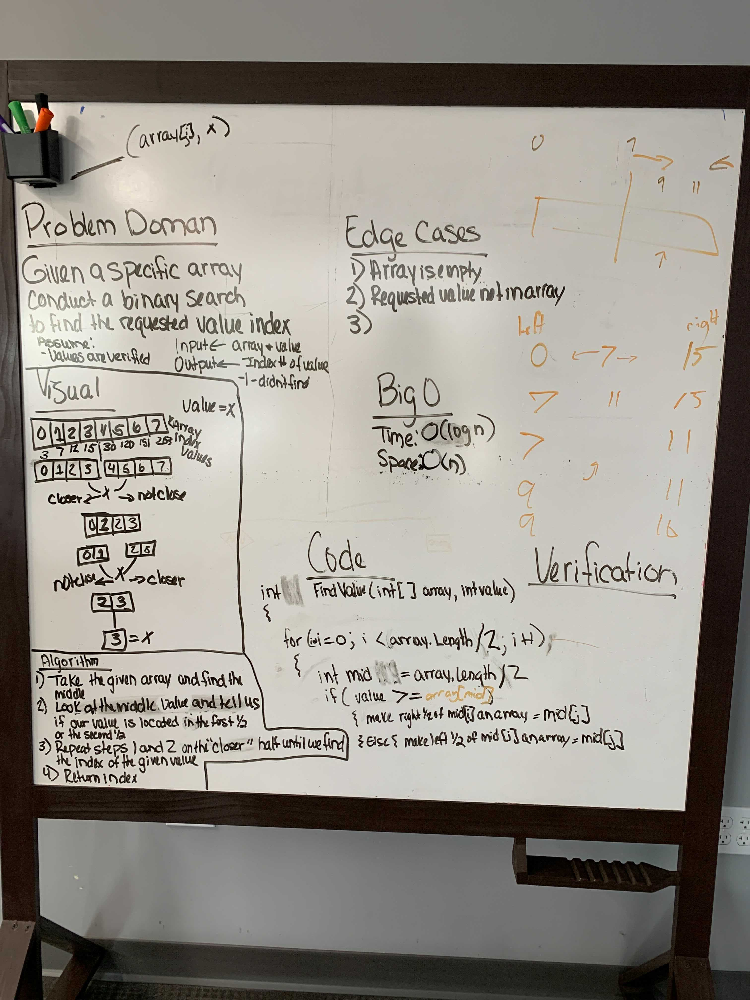

# Array Binary Search

Given a specific array, conduct a binary search to find the requested value index.

## Whiteboard Process

## Aproach and Efficiency

Make a for loop that iterates through the array to find the middle index. If the value given is greater than the middle index, you know to repeat the process for the right side of the array, or the values of i after the middle index. You repeat the process until you find the value.. Or don't.
