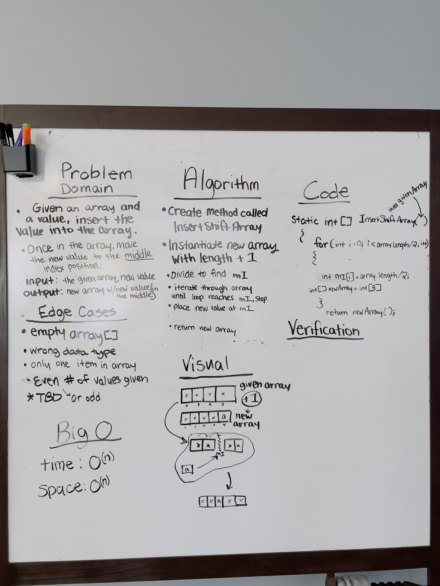

# Insert Shift Array

Given an array, return the array reversed.

## Whiteboard Process

## Aproach and Efficiency

Given an array, and a value, write a function that will add that value to the array. Set the position of the new value to be at the middle index of the array.