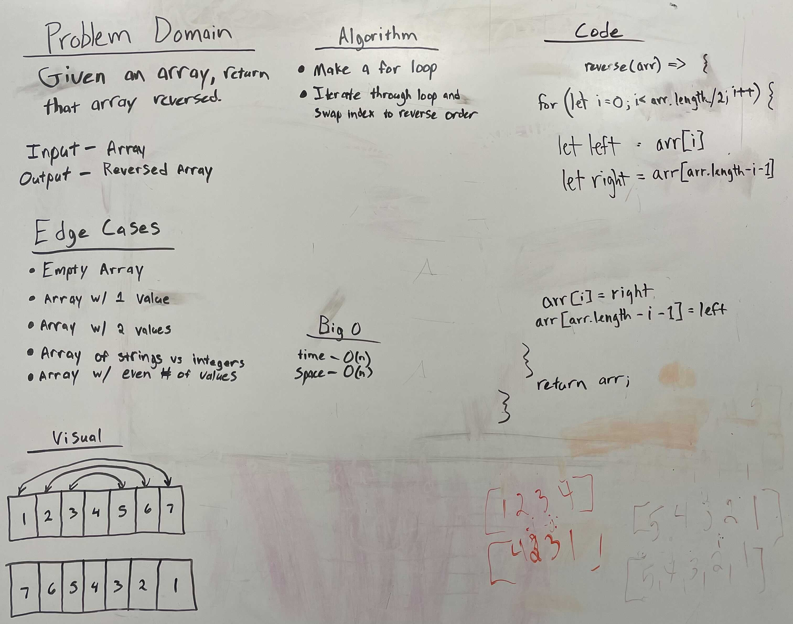

# Reverse an Array

Given an array, return the array reversed.

## Whiteboard Process

## Aproach and Efficiency

Make a for loop that iterates through the array and swaps the index to reverse order.
