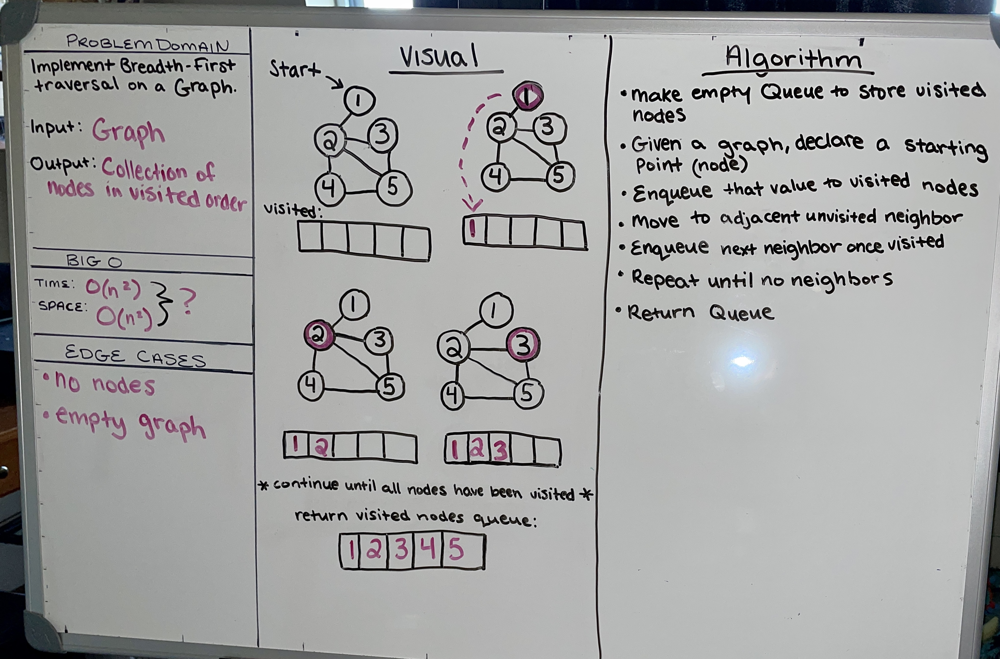

# Implement a breadth-first traversal on a graph.

Given a graph, create a Queue and traverse graph enqueueing each value.

## Whiteboard Process

## Aproach and Efficiency

Make an empy Queue to store visited nodes. Givin a graph find a starting point or node. Enqueue that value and move to adjacent unvisited neighbor. Enque and move to next neighbor once visited. Repeat until there are no neighbors. Return Queue.