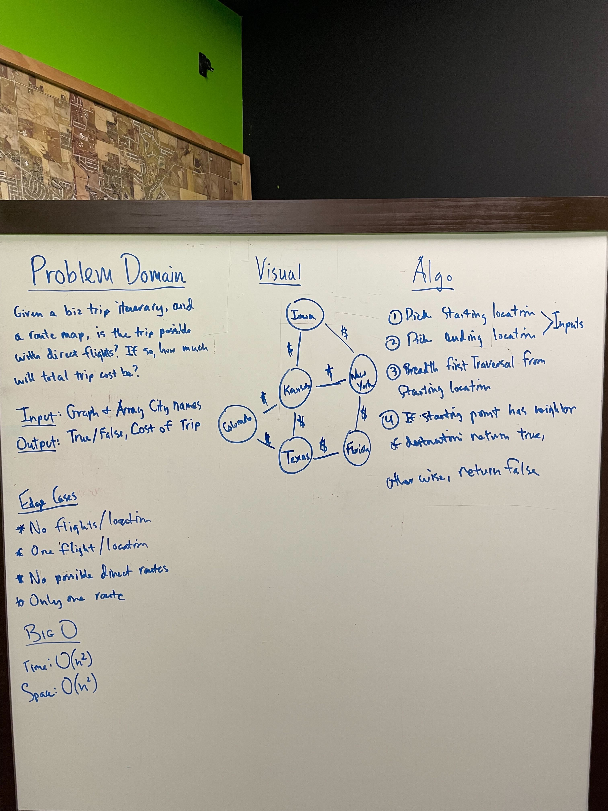

# Business Trip Graph

Given a business trip itinerary, and an Alaska Airlines route map, is the trip possible with direct flights? If so, how much will the total trip cost be?

## Whiteboard Process

## Aproach and Efficiency

Pick the starting location(node). Pick the ending location. Do a breadth first traversal from the starting node to the neighboring nodes. If one of the neighbors is the ending location, return true. If no neighors of the starting point are your ending location return false.
