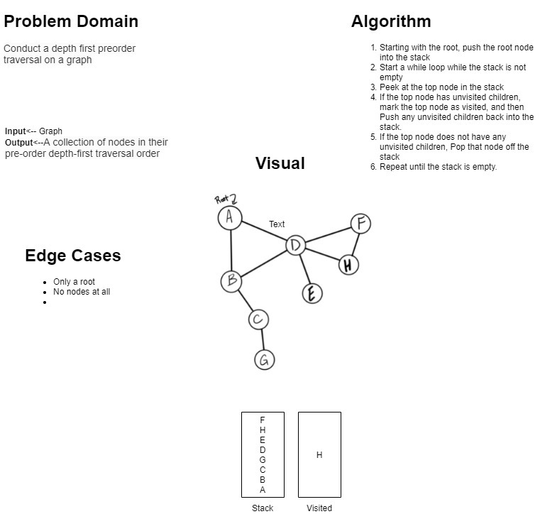

# Conduct a depth first preorder traversal on a graph

Given a graph, conduct a depth first preorder traversal, and return the nodes in the order they were traversed.

## Whiteboard Process

## Aproach and Efficiency

Starting with the root, push the root node into a new stack. Make a while loop that runs while the stack is not empty. Peek at the top node in the stack and if the top node has unvisited neighbors, mark the top node as visited, and push any unvisited neighbors back into the stack. If the top node does not have any unvisited neighbors, pop it off the stack and repeat all the steps until the stack is empty.
