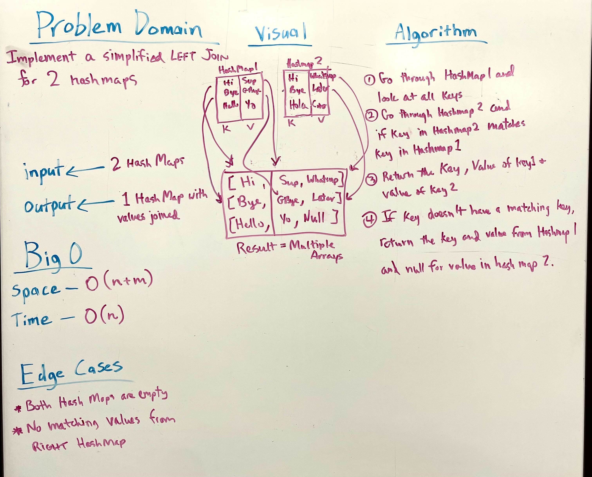

# Implement a simplified LEFT JOIN for 2 Hashmaps.

Given 2 Hashmaps, return an array of left joined values from the Hashmaps.

## Whiteboard Process

## Aproach and Efficiency

Iterate through Hashmap 1 and add keys and their alues to list. Go through Hashmap 2 and add those keys and values as well. If the key is already in the list, add the value of Hashmap 2 to the end of the matching key.