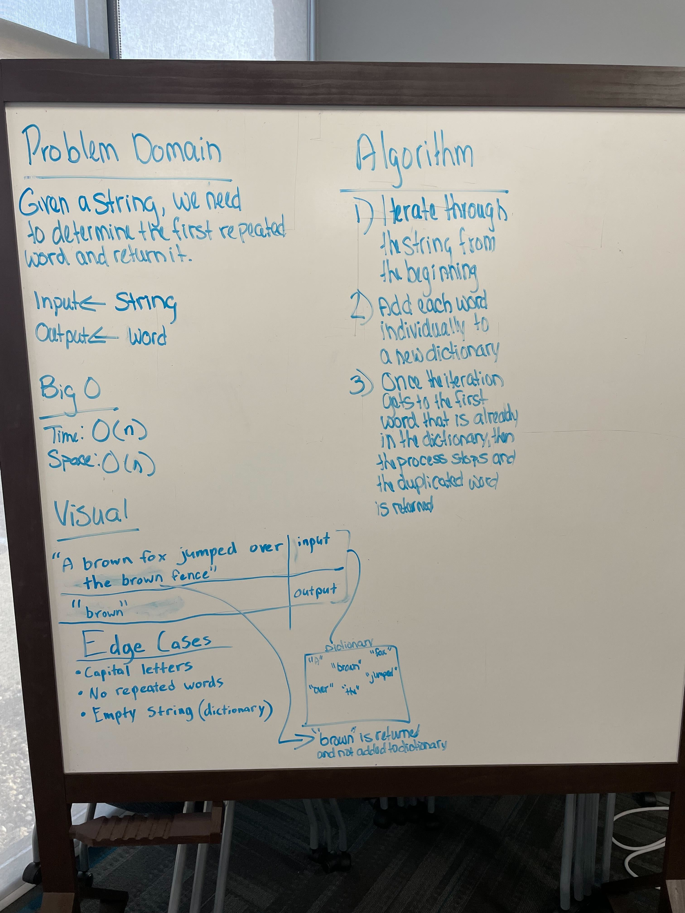

# Find the first repeated word in a book.

Given a string of words, return the word that first repeats itself.

## Whiteboard Process

## Aproach and Efficiency

Make a for loop that iterates through the string. Add each word individually to a new dictionary. Once the iteration gets to the firsy word that is already in the dictionary, then the process(loop) stops and the duplicated word is returned.
