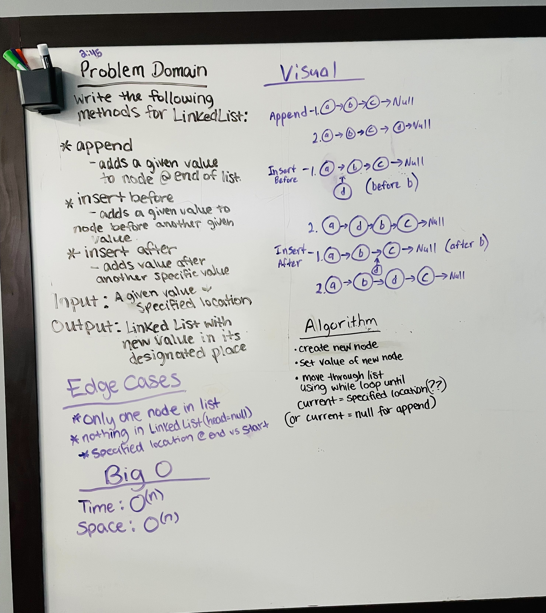

# Linked List Insertions

Given a linked list, insert a node with a value in the specified location.

## Whiteboard Process

## Aproach and Efficiency

Make a while loop that will loop while the current head is null, will asign the next node after the current head to be the new node. Otherwise keep going through the loop.