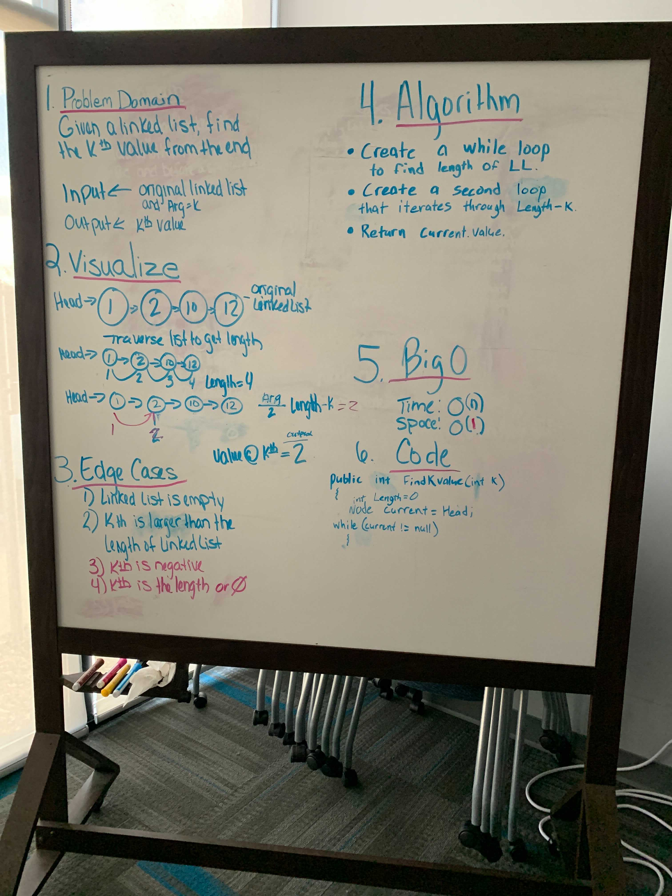

# Find Kth Value

Given a linked list, find the kth value from the end.

## Whiteboard Process

## Aproach and Efficiency

Make a while loop that will loop while the current head is null, and will find the length of the array. Create a for loop that iterated through the length of the array minus the value (k).