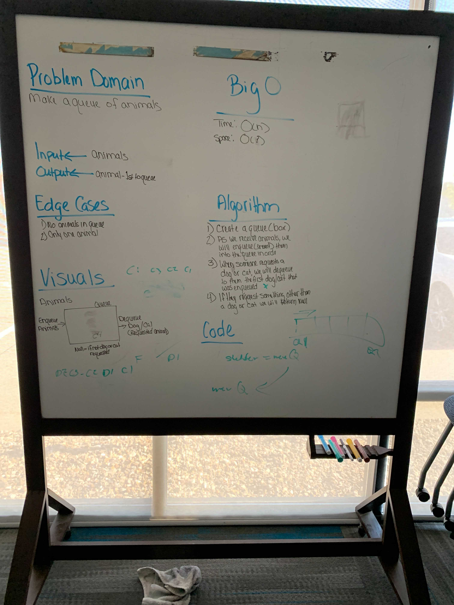

# Queue For An Animal Shelter

Make A first in first out animal shelter.

## Whiteboard Process

## Aproach and Efficiency

Make a Queue that sends the first in the Queue out. If the first animal in the Queue is not what they want, they would be added to a second Queue. Problem with this is that if there are hundreds of dogs up next in the Queue, and someone wants a cat, you would have to make that many more Queues.
