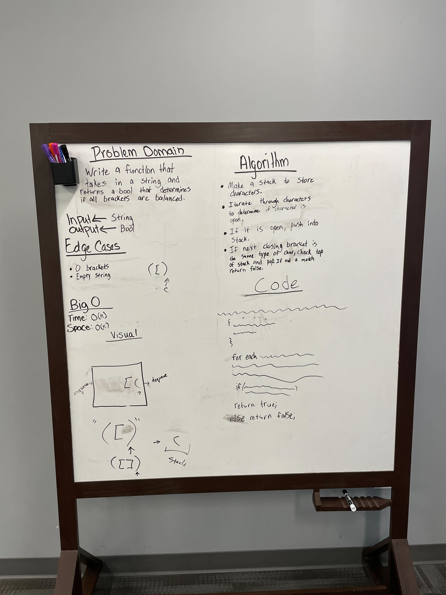

# Stack Queue Brackets

Determine whether or not a string of brackets is valid or not. Return true or false.

## Whiteboard Process

## Aproach and Efficiency

Use a for loop to iterate through the string of characters. Then you would add the first character that is an open bracket to a stack. If the next closing bracket is the same type return true. If not return false.
