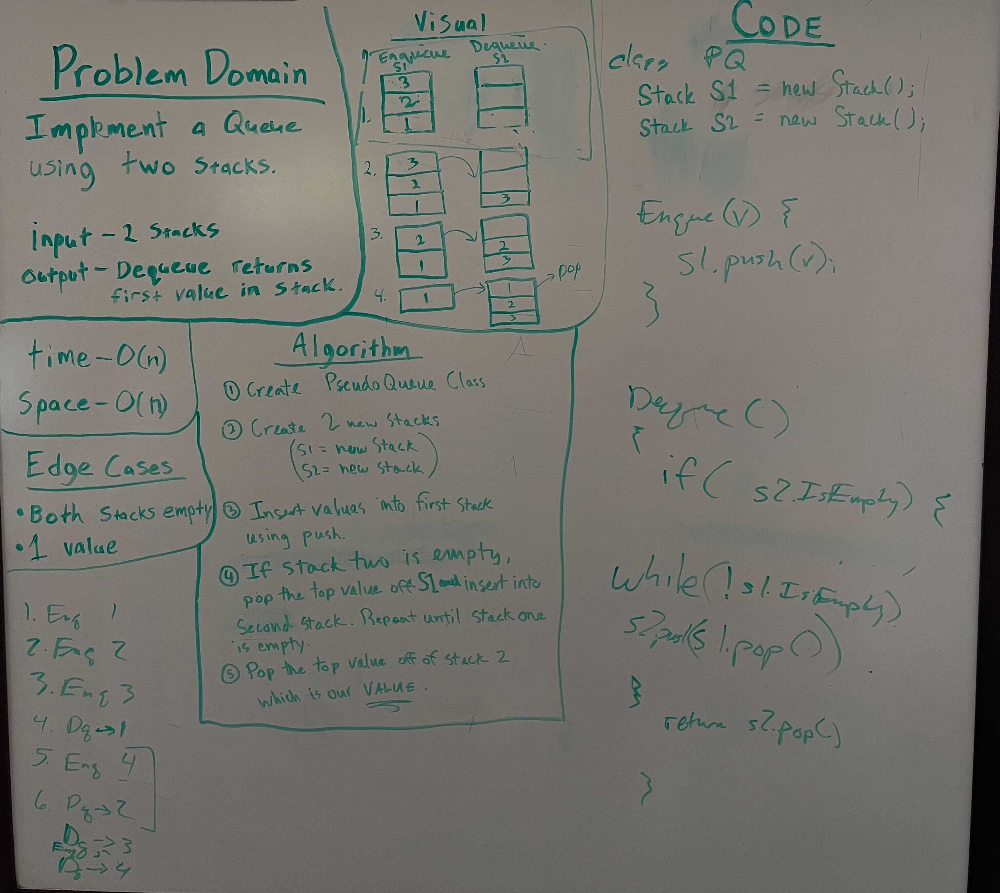

# Implement a Queue using two Stacks.

Using two stacks, implement a gueue by moving (popping) the top value and pushing it to the other stack.

## Whiteboard Process

## Aproach and Efficiency

Create two new Stacks. Insert values into first Stack using push. If Stack 2 is empty, pop the top value off s1 and insert into second Stack. Repeat until Stack 1 is empty. Finally pop the top value off Stack 2.
