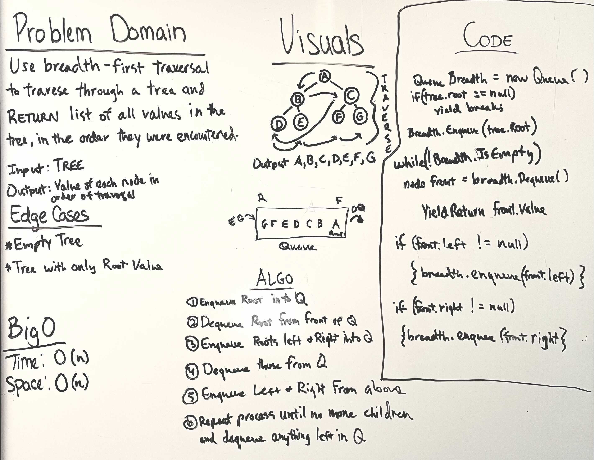

# Tree Breadth First

Use breadth-first traversal to travers through a tree and return list of all values in the tree, in the order they were traversed.

## Whiteboard Process

## Aproach and Efficiency

Enqueue Root into Queue. Dequeue Root from front of Queue. Enqueue Root.Left and Root.Right into Queue. Deque those from the Queue. Enqueue the next left and right and dequeue those. Repeat process until there are no more children.