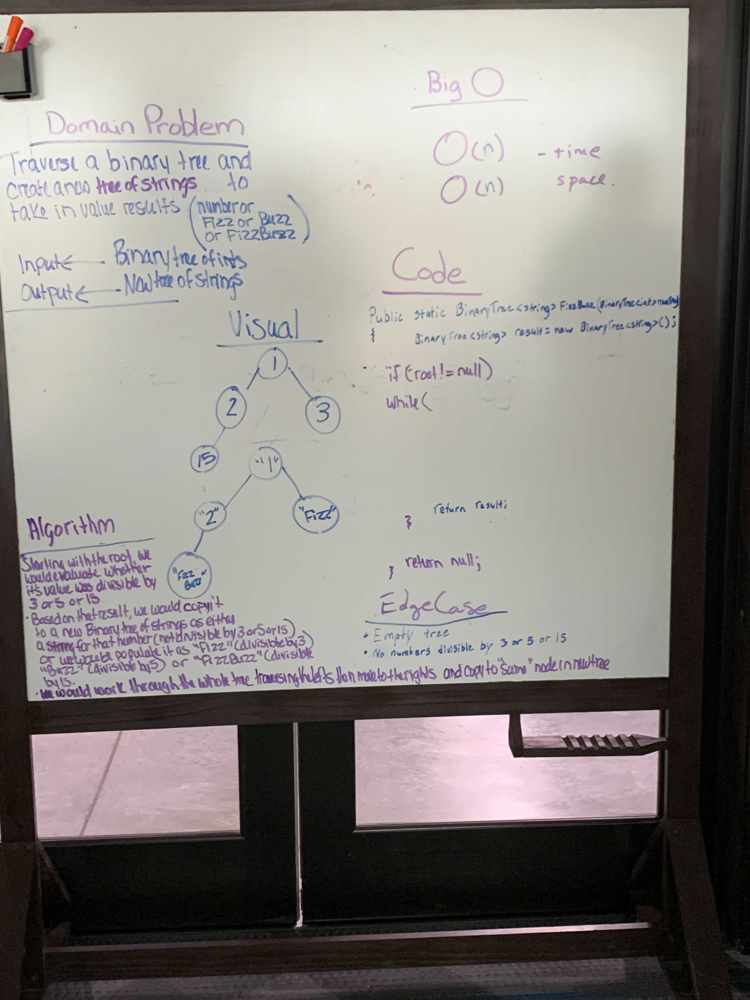

# Tree Fizz Buzz

Traverse a binary tree and create a new tree of strings to take in value results.

## Whiteboard Process

## Aproach and Efficiency

Starting with the root, evalute whether its value is divisible by 3, 5, or 15. For values divisible by 3 replace with fizz. For values divisible by 5 replace with Buzz. For values divisible by 15 replace with FizzBuzz. Copy the value into another tree as a string if not divisible by any of these.
