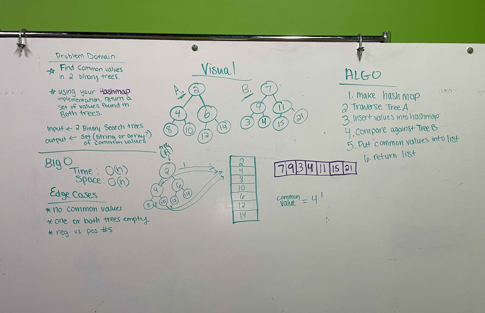

# Find common values in 2 binary trees.

Using hashmap implementation, return a set of values found in both trees.

## Whiteboard Process

## Aproach and Efficiency

First make a hash map. Then traverse one of the trees. Insert the values in that tree into the hashmap. Compare each value in the hashmap with the other trees values. If the hashmap contains the same value as a node in the tree, Return number.
